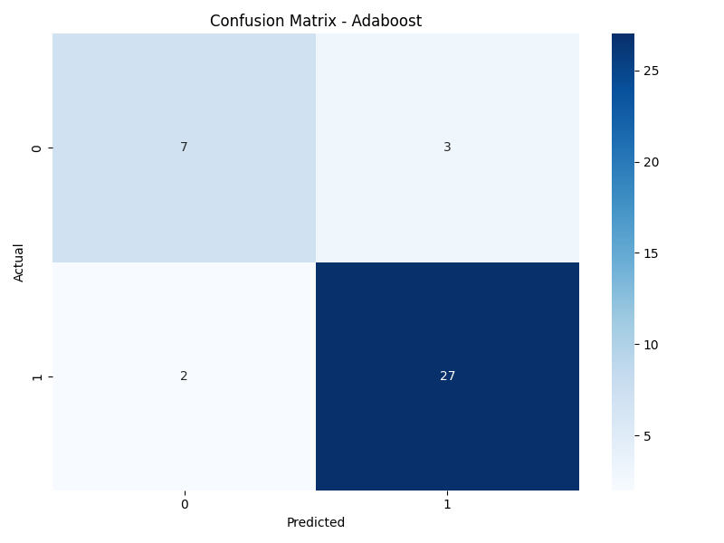
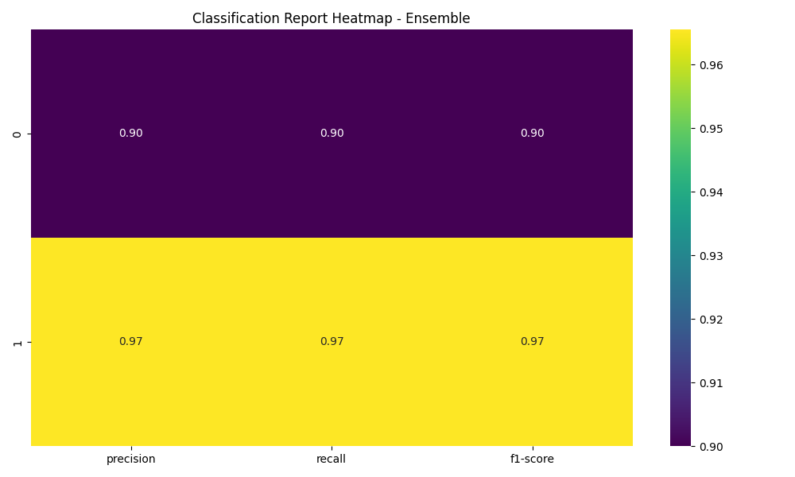
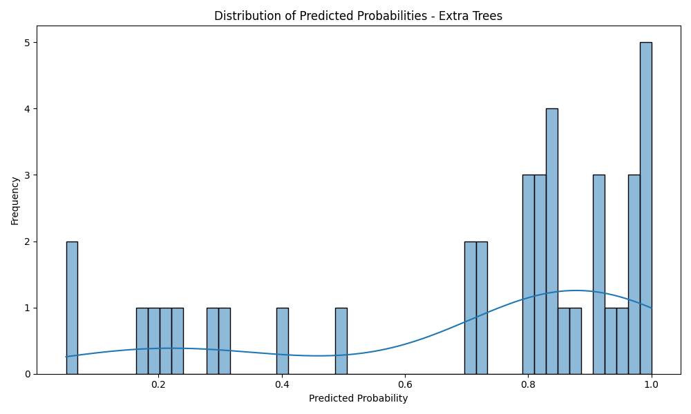
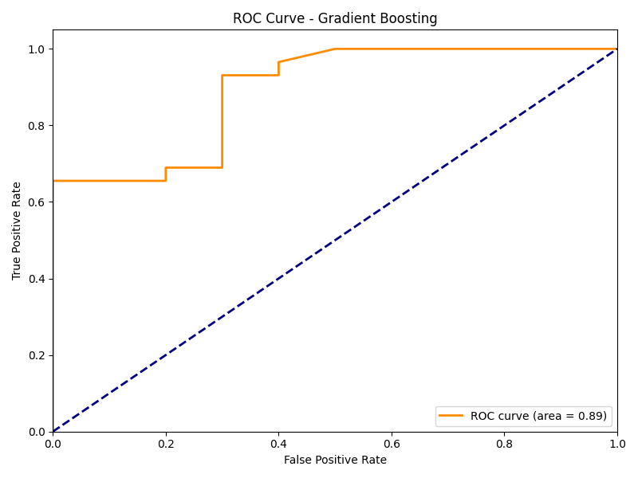
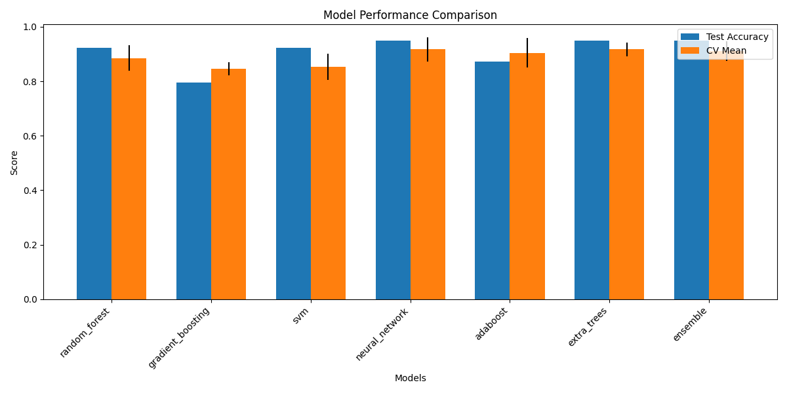
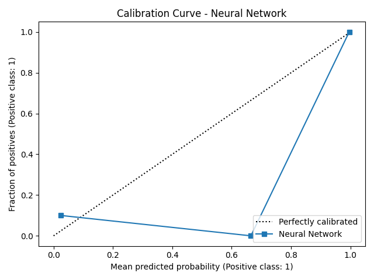
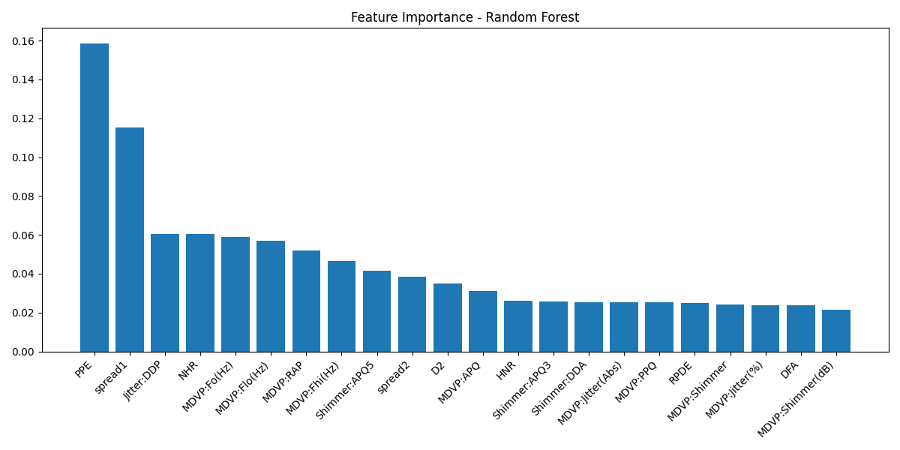
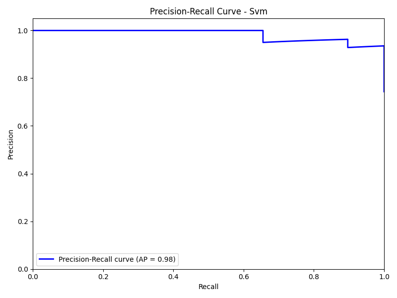

Frontend run 
node "C:\Program Files\nodejs\node_modules\npm\bin\npm-cli.js" run dev

backend
cd backend
 python -m uvicorn main:app --reload


# Parkinson's Insight Web Application

A comprehensive web application for analyzing voice recordings to detect early signs of Parkinson's disease using machine learning.

## Features

- Voice recording and real-time analysis
- Manual input of voice metrics
- Visualization of prediction results
- User authentication and data management via Firebase Realtime Database
- Historical data tracking
- Personalized recommendations based on analysis
- Integration with FastAPI ML backend
- Gemini AI integration for Parkinson's disease information and assistance

## Project Overview

Parkinson's Insight aims to provide an accessible and user-friendly platform for individuals to monitor vocal biomarkers associated with Parkinson's disease. By leveraging machine learning models trained on voice data, the application offers insights into potential risks and tracks changes over time. The frontend is built with React and Vite, utilizing Firebase for authentication and its Realtime Database for storing user profiles, analysis history, and real-time metrics. The backend is a Python FastAPI server that handles the machine learning predictions.

## Setup

### Prerequisites

- Node.js (v16+)
- Python 3.8+ (for the backend)
- Firebase account
- Bun or npm/yarn

### Frontend Setup

1. Install dependencies:
```bash
npm install
# or
bun install
```

### Firebase Setup

1. Create a Firebase project at [https://console.firebase.google.com/](https://console.firebase.google.com/)
2. Enable Authentication with Email/Password and Google sign-in methods.
3. Create a Realtime Database.
4. **Important Security Note:** Secure your Realtime Database by defining appropriate security rules in the Firebase console. Default rules might leave your database open. Ensure only authenticated users can read/write their own data.
5. Register a web app in your Firebase project. You will need to integrate the Firebase configuration directly into your frontend application code where Firebase is initialized (typically in `src/lib/firebase.ts` or a similar file).
6. Make sure to add your app's domain to the authorized domains in Firebase Authentication settings when deploying to production.

#### Database Usage
- Firebase Realtime Database is used for user authentication data, user profiles, real-time voice analysis metrics, and storing structured voice analysis history and detailed reports.

3. Start the development server:
```bash
npm run dev
```

### Backend Setup

1. Navigate to the backend directory and create a Python virtual environment:
```bash
cd backend
python -m venv venv
```
Activate the virtual environment:
   - On Windows (PowerShell/CMD):
     ```powershell
     .\venv\Scripts\Activate.ps1 
     # or for CMD
     # venv\Scripts\activate.bat
     ```
   - On macOS/Linux (Bash/Zsh):
     ```bash
     source venv/bin/activate
     ```

2. Install dependencies:
```bash
pip install -r requirements.txt
```

3. Train the models:
```bash
python train_models.py
```
This command will train various machine learning models and save them along with performance visualizations in the `backend/model/` directory.

4. Start the FastAPI server (from the `backend` directory):
```powershell
python -m uvicorn main:app --reload
```
The server will typically be available at `http://localhost:8000`.

## Model Performance Visualizations

The following images are generated during the model training process (`python train_models.py`) and provide insights into their performance and characteristics.

### AdaBoost Model - Confusion Matrix

*   **What it is:** A Confusion Matrix is a table that summarizes the performance of a classification model. It shows the number of True Positives (TP), True Negatives (TN), False Positives (FP), and False Negatives (FN).
    *   TP: Correctly predicted positive cases (e.g., model correctly identifies a patient with Parkinson's).
    *   TN: Correctly predicted negative cases (e.g., model correctly identifies a healthy individual).
    *   FP: Incorrectly predicted positive cases (Type I error, e.g., model flags a healthy individual as having Parkinson's).
    *   FN: Incorrectly predicted negative cases (Type II error, e.g., model misses a Parkinson's diagnosis in a patient).
*   **Use in Real-time/General ML:** It's crucial for understanding the types of errors a model makes, which is vital for applications where misclassifications have different costs (e.g., medical diagnosis).
*   **In this Project:** For the AdaBoost model, this matrix shows how well it distinguishes between individuals with and without Parkinson's based on voice features. A good model would have high TP and TN, and low FP and FN. This helps assess the model's reliability for potential screening.

### Ensemble Model - Classification Report Heatmap

*   **What it is:** This heatmap visualizes the key metrics from a Classification Report: Precision, Recall, and F1-score for each class (in this case, Parkinson's positive and negative).
    *   **Precision:** Out of all the instances the model predicted as positive, how many were actually positive? (TP / (TP + FP)). High precision means fewer false positives.
    *   **Recall (Sensitivity):** Out of all the actual positive instances, how many did the model correctly identify? (TP / (TP + FN)). High recall means fewer false negatives.
    *   **F1-score:** The harmonic mean of Precision and Recall, providing a single score that balances both. (2 * (Precision * Recall) / (Precision + Recall)).
*   **Use in Real-time/General ML:** Helps in evaluating a model's performance per class, especially useful when class imbalance is present or when both false positives and false negatives need to be minimized.
*   **In this Project:** The heatmap for the ensemble model provides a quick visual summary of its balanced performance in identifying Parkinson's. It shows if the model is good at both correctly identifying those with the condition (high recall for positive class) and not misdiagnosing healthy individuals (high precision for positive class, high recall for negative class).

### Extra Trees Model - Predicted Probabilities Distribution

*   **What it is:** This histogram shows the distribution of the probabilities predicted by the Extra Trees classifier for the positive class (e.g., probability of having Parkinson's).
*   **Use in Real-time/General ML:** It helps understand the model's confidence in its predictions. A well-separated distribution (e.g., probabilities clustering near 0 for negative cases and near 1 for positive cases) indicates good discriminatory power. If many probabilities are clustered around 0.5, the model might be uncertain for those cases.
*   **In this Project:** This plot for the Extra Trees model reveals how confident it generally is when making predictions. Ideally, for individuals with Parkinson's, the predicted probabilities should be high, and for healthy individuals, they should be low. This distribution can help in setting appropriate thresholds for classifying a new voice sample.

### Gradient Boosting Model - ROC Curve

*   **What it is:** An ROC (Receiver Operating Characteristic) curve plots the True Positive Rate (Recall/Sensitivity) against the False Positive Rate (1 - Specificity) at various classification thresholds.
    *   **AUC (Area Under the Curve):** Measures the entire two-dimensional area underneath the entire ROC curve. An AUC of 1 represents a perfect model, while an AUC of 0.5 suggests a model with no discriminative ability (like random guessing).
*   **Use in Real-time/General ML:** ROC curves are widely used to evaluate the performance of binary classifiers. A model with a curve closer to the top-left corner is better. AUC provides a single number to summarize this performance.
*   **In this Project:** The ROC curve for the Gradient Boosting model illustrates its ability to distinguish between Parkinson's positive and negative cases across all possible thresholds. A higher AUC indicates that this model is better at correctly classifying individuals based on their voice features.

### Overall Model Comparison

*   **What it is:** This bar chart compares different trained models based on two key metrics: Test Accuracy and Cross-Validation (CV) Mean Score. Error bars on the CV Mean might represent the standard deviation of CV scores.
    *   **Test Accuracy:** The percentage of correct predictions on a held-out test dataset.
    *   **CV Mean Score:** The average performance (e.g., accuracy) across multiple folds of cross-validation on the training data. This gives a more robust estimate of model performance and how well it might generalize to unseen data.
*   **Use in Real-time/General ML:** Essential for selecting the best performing and most generalizable model among several candidates.
*   **In this Project:** This chart helps in identifying which of the trained models (Random Forest, SVM, etc., including the Ensemble) performs best on the Parkinson's voice dataset. It aids in deciding which model(s) to deploy for the application's prediction tasks.

### Neural Network Model - Calibration Curve

*   **What it is:** A Calibration Curve (also known as a reliability diagram) plots the actual proportion of positive cases (true frequency) against the predicted probability output by the model. A perfectly calibrated model would have a curve along the diagonal (y=x), meaning if it predicts a 70% probability, then among all cases where it predicted 70%, approximately 70% are actually positive.
*   **Use in Real-time/General ML:** Crucial when the actual probability values are important, not just the final classification. For example, if these probabilities are used for risk assessment or decision-making where the degree of confidence matters.
*   **In this Project:** This curve for the Neural Network shows how reliable its predicted probabilities of having Parkinson's are. If the curve is close to the diagonal, it means the probabilities output by the model can be trusted. If it deviates significantly, the probabilities might be over or under-confident.

### Random Forest Model - Feature Importance

*   **What it is:** This bar chart displays the relative importance of each input feature (vocal characteristic) in making predictions by the Random Forest model. Features with higher bars are considered more influential by the model.
*   **Use in Real-time/General ML:** Helps in understanding which features are driving the model's decisions (interpretability). It can also be used for feature selection to simplify models and potentially improve performance or reduce data collection needs.
*   **In this Project:** This plot reveals which specific voice features (e.g., jitter, shimmer, HNR, pitch variations) the Random Forest model found most indicative when distinguishing between individuals with and without Parkinson's. This can offer insights into the vocal biomarkers that are most significant according to this model.

### SVM Model - Precision-Recall Curve

*   **What it is:** A Precision-Recall (PR) curve plots Precision (y-axis) against Recall (x-axis) for different classification thresholds. It's particularly useful for evaluating models on imbalanced datasets where the positive class is rare.
    *   **AP (Average Precision):** Summarizes the PR curve into a single value, representing a weighted mean of precisions achieved at each threshold, with the increase in recall from the previous threshold used as the weight.
*   **Use in Real-time/General ML:** When the cost of false negatives is high and the positive class is infrequent (e.g., fraud detection, rare disease screening), the PR curve provides a better picture of performance than an ROC curve.
*   **In this Project:** For the SVM model, this curve shows its ability to correctly identify Parkinson's cases (high recall) without incorrectly flagging too many healthy individuals as having Parkinson's (high precision). A curve closer to the top-right corner indicates better performance. This is important for ensuring the tool is both sensitive and specific, especially in a screening context.

## Usage

1. Open your browser and navigate to `http://localhost:3000`
2. Sign up or log in to your account
3. Navigate to the Voice Analysis page
4. Click "Start Recording" and speak into your microphone
5. Click "Stop Recording" when finished
6. Click "Analyze Voice" to process the recording
7. View the analysis results and recommendations

## Security

- All voice data is processed locally before being sent to the server for analysis.
- User authentication is handled through Firebase Authentication.
- Data is stored in Firebase Realtime Database. **It is crucial to set up appropriate Firebase Security Rules to protect user data.**
- HTTPS should be enforced for all API communications in a production environment.

## Contributing

1. Fork the repository
2. Create a feature branch
3. Commit your changes
4. Push to the branch
5. Create a Pull Request

## API Integration

### API Endpoints

- `GET /` - Health check endpoint for the backend server.
- `POST /predict` - Voice analysis prediction endpoint. Expects voice metrics and returns prediction results.
- `GET /models` - Get available machine learning models information from the backend (e.g., names, descriptions if available).

### API Request Format (for `/predict`)
```json
{
  "pitch": 120.5,
  "jitter": 0.005,
  "shimmer": 0.04,
  "hnr": 20.5
}
```

### API Response Format (for `/predict`)
```json
{
  "status": true,
  "confidence": 0.85,
  "severity": 75,
  "model_predictions": {
    "random_forest": true,
    "svm": true,
    "neural_network": false,
    "xgboost": true
  },
  "model_probabilities": {
    "random_forest": 0.9,
    "svm": 0.8,
    "neural_network": 0.4,
    "xgboost": 0.85
  },
  "recommendations": [
    "Schedule an appointment with a healthcare provider.",
    "Consider speech therapy sessions.",
    "Practice recommended voice exercises twice daily."
  ]
}
```

## Gemini AI Integration

This project includes integration with Google's Gemini AI for enhanced user assistance:

- **GeminiChat**: A chat interface (likely in the Resources page or a dedicated section) for Q&A about Parkinson's disease.
- **GeminiBot**: A floating assistant accessible throughout the application for quick help and information.

To set up the Gemini AI integration, you will need to configure your Gemini API key. The scripts `scripts/setup-gemini.bat` (for Windows) and `scripts/setup-gemini.sh` (for macOS/Linux) are intended to help with this process, likely by setting up necessary configurations or environment variables. Please inspect these scripts and adapt them as needed for your environment. The file `GEMINI_SETUP.md` is intended for more detailed instructions but is currently empty.

Example setup command (inspect the script first):
```bash
# On Windows
scripts\setup-gemini.bat
# On macOS/Linux
bash scripts/setup-gemini.sh
```

For more details, please refer to the (currently empty) [GEMINI_SETUP.md](GEMINI_SETUP.md) or the setup scripts.

## License

This project is licensed under the MIT License - see the LICENSE file for details.

